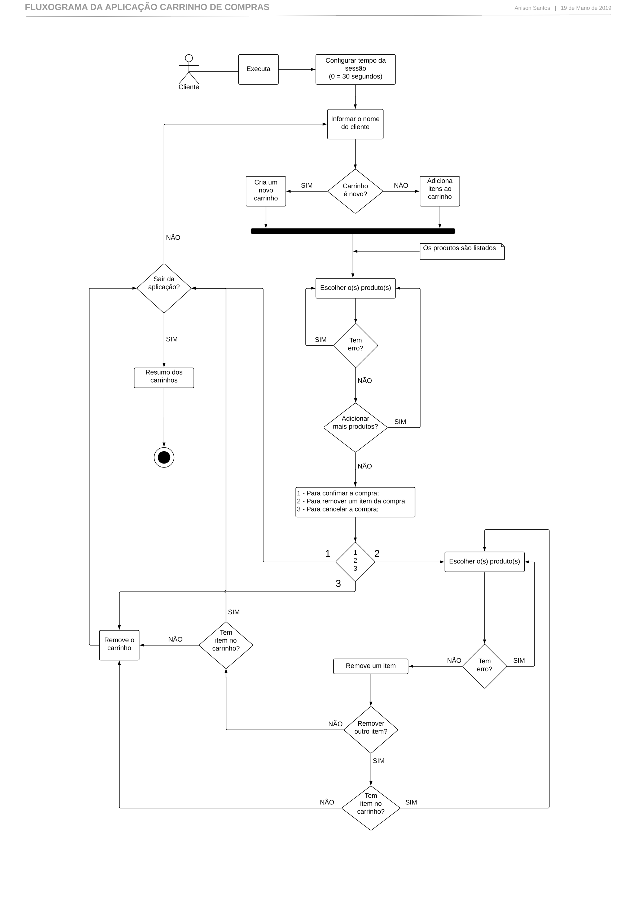
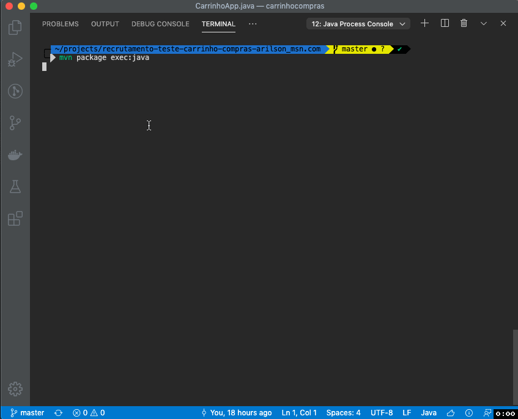
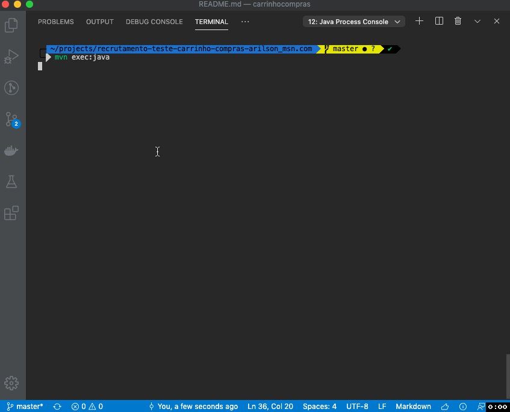
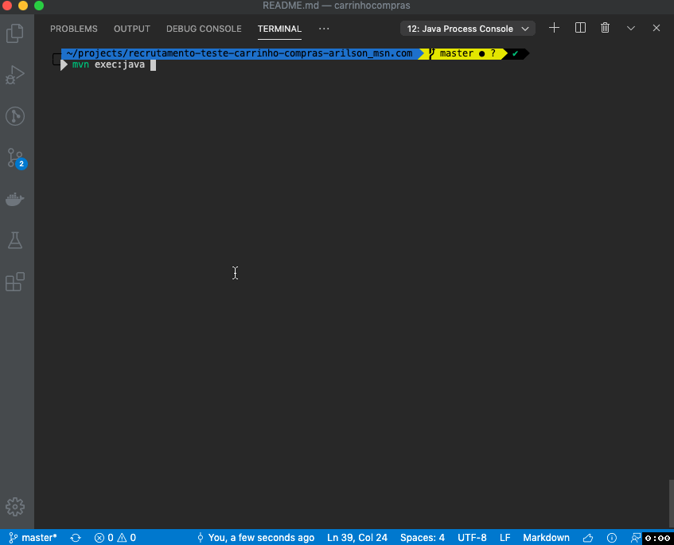
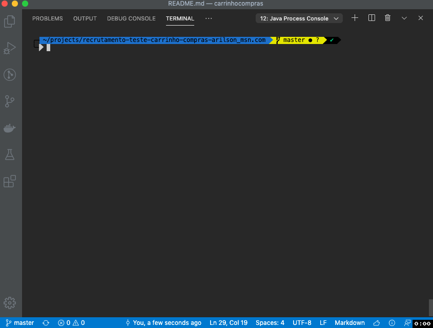
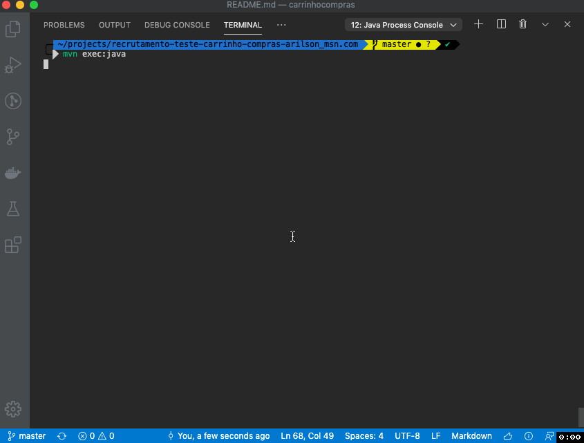
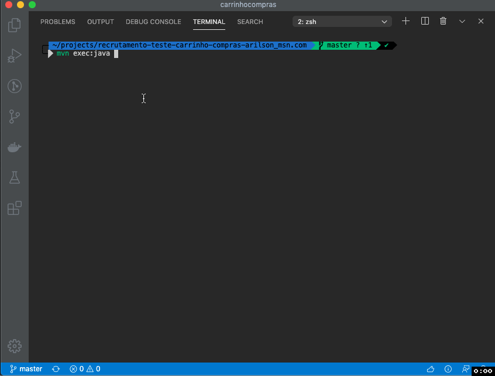

Nesta prova será necessário implementar os métodos das classes conforme descrições dos Javadocs correpondentes.

Você poderá criar novos atributos e métodos, mas é proibido mover as classes de pacote. Também é proibido mudar a assinatura dos métodos e construtores já existentes, exceto o construtor da classe CarrinhoCompras.

A prova deve ser resolvida utilizando obrigatoriamente Java 8. Não será necessário implementar nenhum tipo de interface gráfica ou mecanismo de persistência.

Todos os requisitos funcionais tem que ser atendidos 100% para que sua solução seja aprovada. Sua prova precisa compilar via Maven, impreterivelmente - não basta rodar apenas via sua IDE.  

---
  
**Documentação e instruções para uso da aplicação Carrinho de Compras**

#### Fluxograma:

---

## Exemplos  

#### 1. Carrinho com dois itens cadastrados com validação do preço unitário  
Inicia uma compra  
Adiciona o produto 1 ao carrinho  
Adiciona novamente o produto 1, com preço inválido (exceção lançada)  
Adiciona novamente o produto 1, com o preço correto  
Adiciona o produto 2 ao carrinho  
Fecha o carrinho  
Sai da aplicação  

#### 2. Executando com a sessão configurada para 5 segundos  
Inicia uma compra (sessão de 5 segundos)  
Adiciona o produto 1 ao carrinho  
Sessão expira  
Carrinho descartado  
Novo carrinho é adicionado  
Adiciona 02 itens ao carrinho  
Sessao expira novamente  
Sai da aplicação  

#### 3. Carrinho com dois itens cadastrados com validação do preço unitário  
Inicia com valor inválido par a sessão, o valor  30 é assumido  
Inicia uma compra  
Adiciona 02 itens ao carrinho  
Fecha carrinho  
Inicia nova compra  
Adiciona 01 item ao carrinho  
Fecha o carrinho  
Inicia nova compra  
Adiciona 01 item ao carrinho  
Cancela a compra  
Sai da aplicação  

#### 4. Editando uma compra fechada anteriormente na mesma sessão 
Inicia uma compra 
Adiciona o produto 1 ao carrinho do Joao   
Fecha carrinho 
Novo carrinho é adicionado  
Adiciona o produto 2 ao carrinho da Maria  
Fecha carrinho  
O carrinho do João é chamado novamente  
Adicionado mais um para o produto 1, com preço diferente da primeira compra
Fecha carrinho 
Sai da aplicação  

#### 5. Removendo produtos do carrinho 
Inicia uma compra  
Adiciona o produto 1 ao carrinho do Joao  
Adiciona o produto 2 ao carrinho do Joao  
Remove o produto 1  
Fecha carrinho  
Novo carrinho é adicionado  
Adiciona o produto 1 ao carrinho da Maria  
Adiciona o produto 2 ao carrinho da Maria  
Remove os produtos 1 e 2 do carrinho da Maria  
Fecha carrinho  
O carrinho da Maria é descartado por estar vazio    
Restou o carrinho do Joao com o prdouto 1  
Sai da aplicação  

#### 6. Inserindo valores inválidos 
Inicia uma compra 
Preenche dados com valores inválidos

---

### Instruções para a execução da aplicação Carrinho de Compras.

##### 1) Para primeira execução, no diretório da aplicação, digite a instrução abaixo:  
***mvn package exec:java***

##### 2) Para as próximas execuções, no diretório da aplicação, digite a instrução abaixo:  
 ***mvn exec:java***
